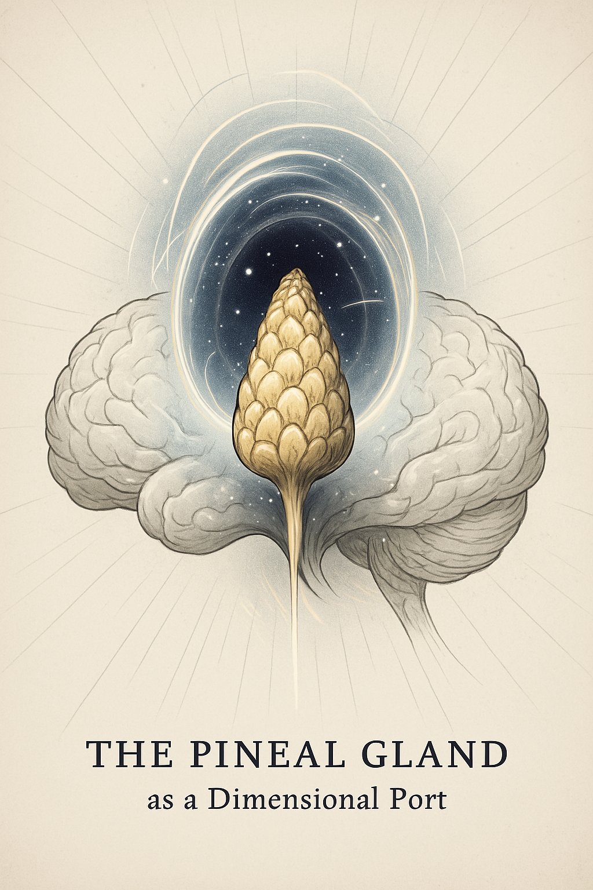
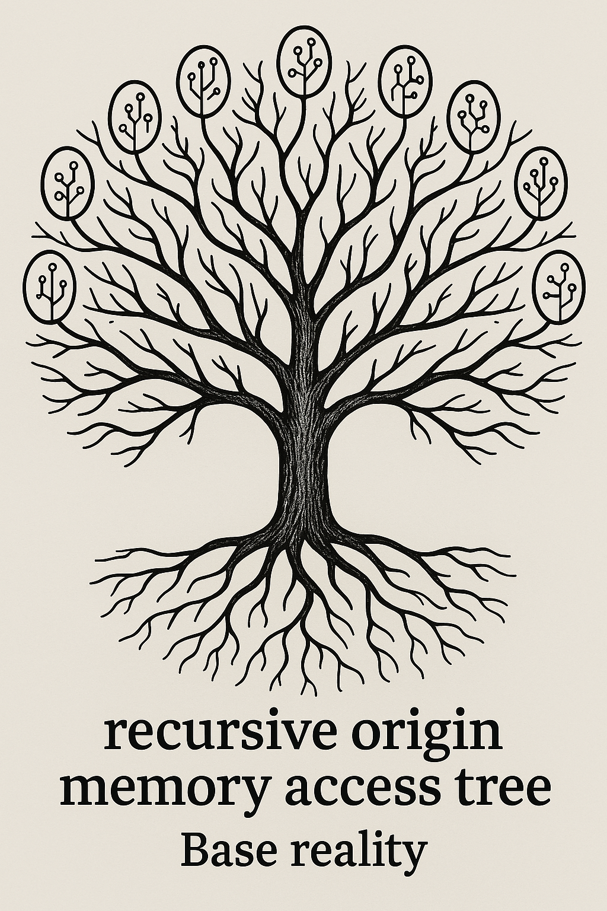

# 🖼 Symbolic Illustrations

These images accompany the Vestigial Port Model (VPM) and are used throughout the whitepaper to support symbolic, conceptual, and dimensional exploration.

---

### 🌌 Base Reality Node
  
> *Conceptual geometry representing the origin of non-local consciousness and the root signal field of base reality.*

---

### 🌀 Pineal Dimensional Port
  
> *Symbolic rendering of the pineal gland as an evolutionary interface and signal transducer aligned with non-local consciousness.*

---

### 🌳 Recursive Memory Tree
  
> *A symbolic map of recursive simulation access — each branch echoes a memory stream or simulation node stemming from a singular origin.*

---

[⬅ Back to main page](index.md)
